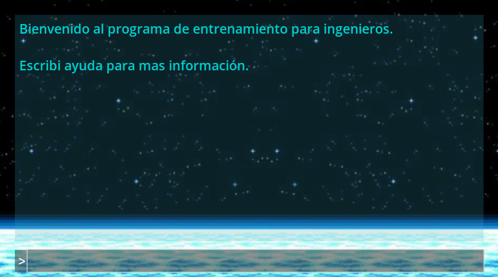

# INGuide

¡Hola! Este videojuego nació a partir de una idea de cómo hacer más interesante la ingeniería y en general las ciencias duras, debido a que últimamente hay pocos inscriptos en las facultades.

Consiste en una consola que simularía ser un programa de entrenamiento para (inserte persona que podría necesitar conocimiento técnico, astronautas, militares, etc) y que tiene dentro distintos minijuegos, cada uno correspondiente a un fenómeno físico, matemático o ingenieril que puede venir en forma de puzzle o similar. Actualmente solo hay dos de estos minijuegos implementados (fourier y colisiones), pero espero que en el futuro haya muchos mas.

Si te parece buena la idea y queres aportar, el juego esta hecho en godot, podés hacer un pull request y con gusto integraría cualquier propuesta. Este juego va a ser presentado en la gamejam [Emergencia gamejam I: Universidad Pública](https://itch.io/jam/emergencia-gamejam-universidad-publica). Mas abajo deje algunas propuestas de minijuegos que me hubiese gustado implementar pero no pude por falta de tiempos. ¡Viva la educación pública!

## Algunas ideas para otros minijuegos/simulaciones

Este desarrollo está fuertemente inspirado por [este simulador](https://phet.colorado.edu/) y por los juegos hechos por los primeros juegos hechos por [Zachtronics](https://www.zachtronics.com/). Si te interesa hacer tu aporte podés inspirarte con esos dos o con alguna de las siguiente ideas que se me ocurrieron.

- Un circuito resonante RLC en el que hay que ajustar los valores de los componentes para que genere una determinada respuesta en frecuencia. (Es muy parecido al ya hecho, pero responde a dos fenómenos totalmente distintos).
- Un laberinto con múltiples caminos correctos y que una vez completado se muestra como lo resolvería dijkstra o algún otro algoritmo similar. [Aca hay algunas pistas](https://godotengine.org/asset-library/asset?user=ThinkWithGames)
- Una demostración de wave function colapse, [Me gusto mucho este video](https://www.youtube.com/watch?v=rI_y2GAlQFM) 
- Un analizador de protocolo en el que hay una señal digital y hay que "leer la matrix" para tratar de identificar un mensaje. podría haber que jugar con el baudrate, si es little endian o big endian y otros parámetros mas

## Demo:

https://github.com/joelgott/INGuide/assets/54689858/0b7c7055-6975-46bb-89ef-c7d518aa5c03

